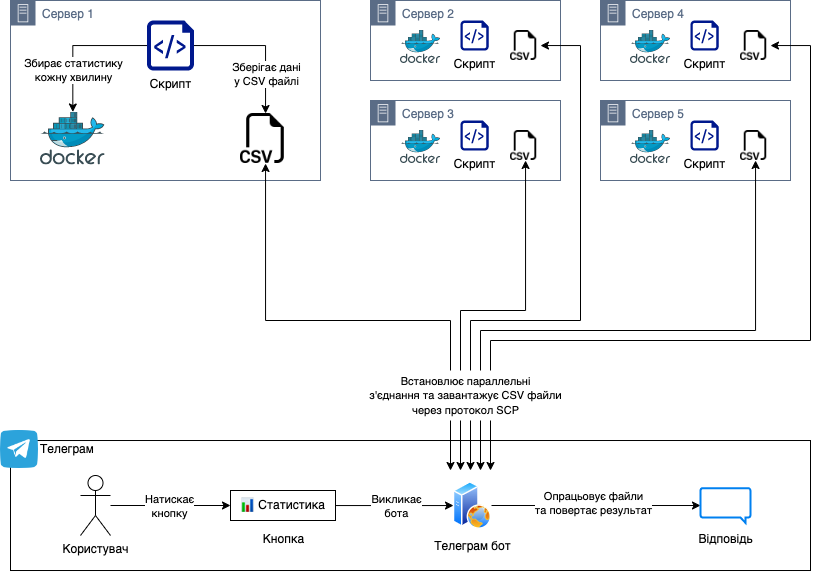

# Телеграм бот для отримання статистики з Docker контейнерів
Після завершення налаштування, ви зможете отримувати наступну інформацію з серверів:


Де,
* Час атаки - найдовший час роботи контейнерів
* Відправлено трафіку - сумарне значення трафіку згенерованого усіма серверами
* Чемпіон - сервер який згенерував найбільше трафіку

Схожа інформаціє видається для кожного окремого сервера, разом із середнім навантаженням процесору та використання оперативної памʼяті за весь час роботи контейнеру.

## Архітектура


## Налаштування

### Налаштування серверів

1. Створіть сервера
2. Встановіть Docker на кожен сервер
3. Для кожного серверу запустіть докер контейнер у фоновому режимі (з опцією `-d`)
4. Для кожного серверу запустіть скрипт `docker_stats_crawler.sh` у фоновому режимі:

```
nohup bash <(curl -s https://raw.githubusercontent.com/sadviq99/docker-stats-telegram/main/docker_stats_crawler.sh) > /dev/null 2>&1 &
```

### Налаштування бота

1. [Створіть Телеграм бота](https://core.telegram.org/bots#3-how-do-i-create-a-bot) за допомогою BotFather та занотуйте токен
2. Створіть окремий сервер де буде працювати Телеграм бот
3. Встановіть Python 3, `pip3` та `tmux`
4. Склонуйте репозиторій на сервер
```
git clone https://github.com/sadviq99/docker-stats-telegram.git
cd docker-stats-telegram/
```
5. Встановіть потрібні бібліотеки:
```
pip3 install -r requirements.txt
```
6. Додайте ваші сервери до файлу `data/servers.csv`
8. Вкажіть ваш Телеграм токен [у файлі telegram_bot.py](https://github.com/sadviq99/docker-stats-telegram/blob/main/telegram_bot.py#L48)
7. Відкрийте `tmux`, запустіть бота та закрийте `tmux`:
```
tmux

python3 telegram_bot.py

# Натисніть Ctrl+B + d щоб війти з tmux
```
Після цього можете виходити з сервера, бот буде далі працювати. Відкрийте свого бота у Телеграмі та натисніть `/start` щоб разпочати.

## Деталі імплементації

1. Система запиту статистики через кнопку дає можливіть отримувати інформацію саме коли потрібно та запобігнути зайвому спаму, у порівнянні із нотифікаціями за розкладом. Водночас, це підвищую ризик недобросовісного використання, бо кожен запрос користувача повинен буди опрацьован сервером. Можливо, має сенс розглянути варіанти створення requests rate limit на кожного користувача, наприклад, за допомогою [цього](https://github.com/grammyjs/rateLimiter) або будь-якого іншого інструменту.
2. Телеграм бот створює параллельні підключення до серверів щоб максимально пришвидшити час відповіді, значення часу таймауту та кількість спроб можна легко корректувати у файлі [serverconnections.py](https://github.com/sadviq99/docker-stats-telegram/blob/main/helpers/serversconnections.py). Якщо з будь-якої причини потрібно підключатися до серверів послідовно, просто перейменуйте файл [serversconnections_1by1.py](https://github.com/sadviq99/docker-stats-telegram/blob/main/helpers/serversconnections_1by1.py) на `dockerconnections.py` та все буде працювати послідовно.
3. Збір інформації з докер контейнерів виконується кожну хвилину, цей інтервал можна змінювати. Історична інформація потрібна щоб разрахувати середнє навантаження за увесь час атаки, бо значення використання CPU змінюється щосекунди, то ж значення "на зараз" не має сенсу. Водночас, якщо контейтер запущений 2 дні, один день навантаження було 20%, другий день 100%, середнє значення буде 60%. Можливо варто показувати максимальне та мінімальне значення за певний проміжок часу, якщо контейнери будуть працювати довгий час.
4. Значення використання CPU та RAM показуються для самого контейнера, а не для сервера загалом. Наприклад, опертивная памʼять яка використовуються самим докером та іншими процесами не входить до значення RAM яке повертає бот.
5. Наразі розрахунки працюють із припущенням що на одному сервері буде працювати один контейнер, та підключення до серверів буде відбуватися за паролем.
6. Файл [debug.py](https://github.com/sadviq99/docker-stats-telegram/blob/main/debug.py) дозволяє вивести той самий результат у консоль, але без Телеграму.

## Що можна покращити

1. Використати історичні дані контейнера для побудови графіків швидкості трафіку, навантаження, порівняння КПД серверів, тощо.
2. Зробити рейтинг користувачів, хто сумарно згенерував найбільшу кількість трафіку за певний час.

## Корисні ресурси
1. https://github.com/python-telegram-bot/python-telegram-bot/blob/v13.13/examples/inlinekeyboard.py
2. https://github.com/sylhare/docker-stats-graph
